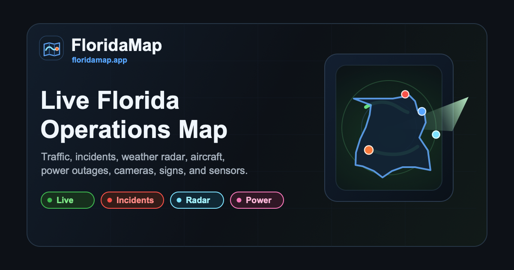

<p align="center">
  
</p>

<h1 align="center">FloridaMap</h1>

<p align="center">
  A live statewide Florida operations map — traffic cameras, incidents, radar, aircraft, power outages, emergency dispatch, and more.<br/>
  <strong><a href="https://floridamap.app">floridamap.app</a></strong>
</p>

<p align="center">
  
</p>

---

## Features

- **Traffic cameras** — live FL511 camera feeds and snapshots
- **Incidents** — statewide traffic incidents and construction zones
- **Weather radar** — live RainViewer radar overlay with NOAA fallback
- **Aircraft** — real-time government and civilian aircraft positions
- **Power outages** — Duke Energy outage map
- **Message signs** — FL511 dynamic message sign content
- **Speed sensors** — live FDOT sensor readings
- **Plate readers** — statewide LPR locations (OpenStreetMap data)
- **Emergency activity** — PulsePoint EMS/fire dispatch
- **Tampa Fire** — Tampa Fire Rescue unit dispatch with grid info

---

## Stack

| Layer | Tech |
|---|---|
| Frontend | Vanilla JS + [Leaflet 1.9.4](https://leafletjs.com/) |
| Video | [hls.js 1.6.16](https://github.com/video-dev/hls.js/) |
| Backend | Python 3 stdlib HTTP server (`proxy.py`) |
| Crypto | `cryptography` package (PulsePoint AES decryption) |

No build step. No npm. No framework.

---

## Running locally

**1. Install dependencies**

```bash
python3 -m pip install cryptography
```

**2. Configure environment**

```bash
cp .env.example .env
# fill in your credentials
```

| Variable | Description |
|---|---|
| `DUKE_ENERGY_AUTH` | Duke Energy API — `Basic <base64 user:pass>` |
| `PULSEPOINT_SECRET` | PulsePoint payload decryption key |

Optional:

| Variable | Default | Description |
|---|---|---|
| `FLORIDAMAP_HOST` | `127.0.0.1` | Bind address |
| `FLORIDAMAP_PORT` | `8765` | Listen port |
| `FLORIDAMAP_DEBUG` | `0` | Set to `1` for verbose logging |

**3. Start**

```bash
bash start.sh
```

Open http://localhost:8765

---

## Deploying

The server runs as a systemd service. Example unit file:

```ini
[Unit]
Description=FloridaMap
After=network.target

[Service]
User=youruser
WorkingDirectory=/path/to/floridamap
EnvironmentFile=/path/to/floridamap/.env
ExecStart=/usr/bin/python3 /path/to/floridamap/proxy.py
Restart=on-failure

[Install]
WantedBy=multi-user.target
```

---

## Project structure

```
index.html              Main HTML shell
app.js                  All application JavaScript
proxy.py                Python proxy / API gateway / static file server
start.sh                Env loader + server launcher
site.webmanifest        PWA manifest
floridamap-logo.svg     SVG logo / favicon
apple-touch-icon.png    iOS home screen icon (180×180)
icon-192.png            PWA icon (192×192)
icon-512.png            PWA icon (512×512)
floridamap-social-card.png    OG image (1200×630)
floridamap-social-square.png  OG square image (1200×1200)
.env.example            Environment variable template
```

---

## Security

- CSP enforced — no `unsafe-inline` on scripts
- All API data HTML-escaped before DOM insertion
- Stream proxy allowlisted to a single upstream host
- **Credentials loaded from environment — no hardcoded secrets**

---

## License

GPLv3 — see [LICENSE](LICENSE)

---

## Data sources

| Data | Source |
|---|---|
| Traffic cameras, incidents, signs | [FL511](https://fl511.com) |
| Aircraft | ADS-B (proxied) |
| Weather radar | [RainViewer](https://www.rainviewer.com/) |
| Power outages | Duke Energy API |
| Emergency dispatch | [PulsePoint](https://www.pulsepoint.org/) |
| Tampa Fire dispatch | Tampa Gov ArcGIS |
| Plate readers | [OpenStreetMap](https://www.openstreetmap.org/) Overpass API |
| Base map tiles | [CartoDB](https://carto.com/basemaps/) |
